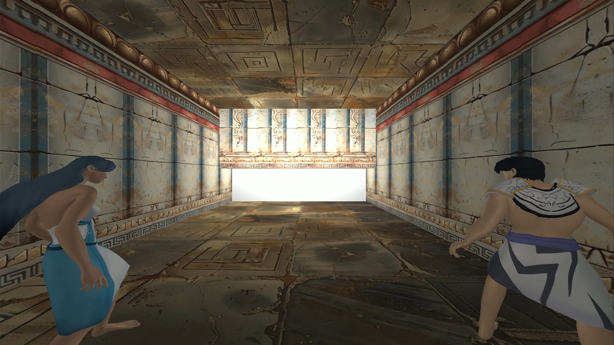
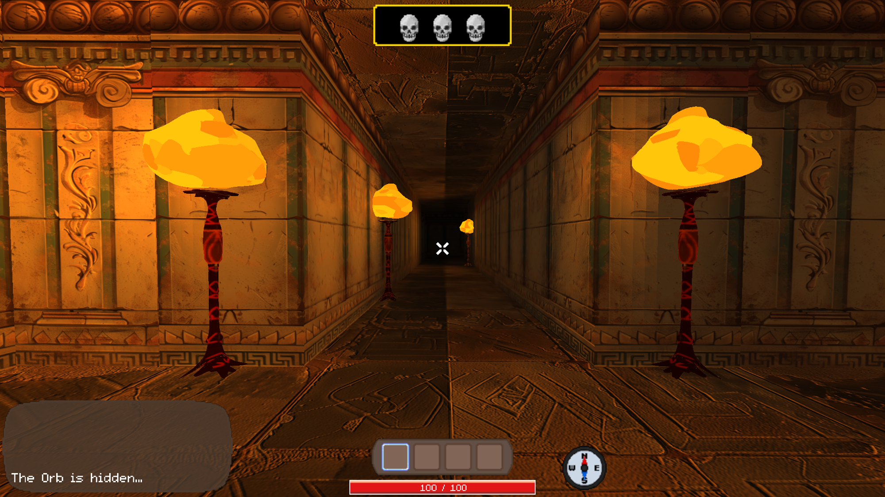
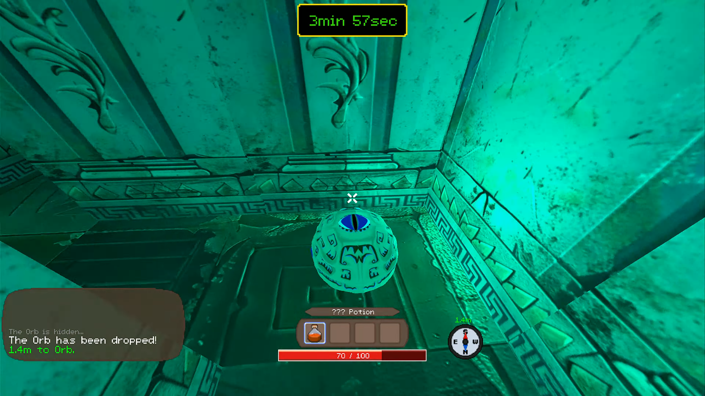
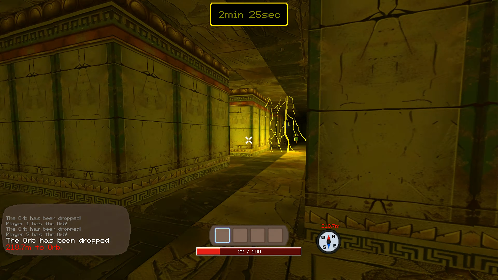
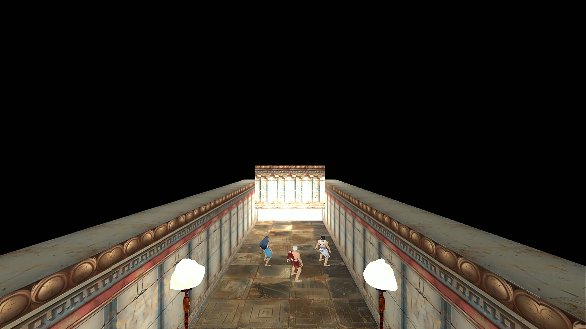
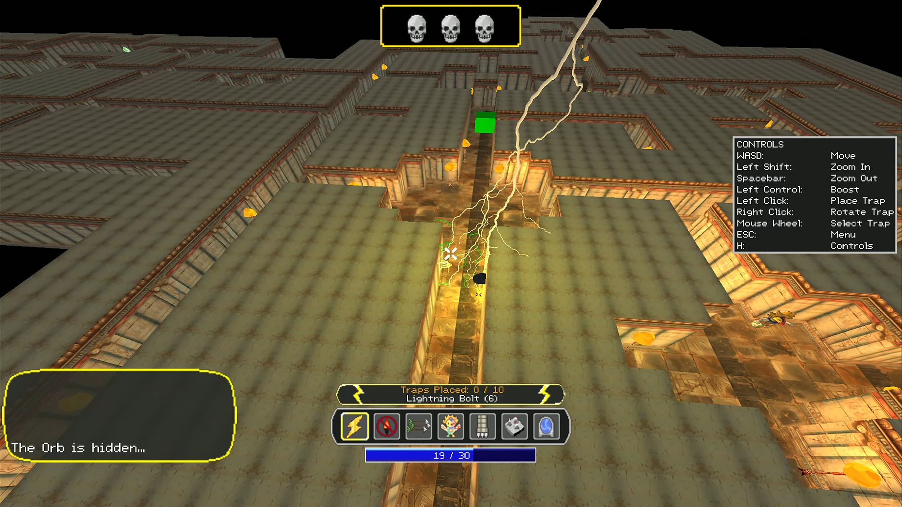
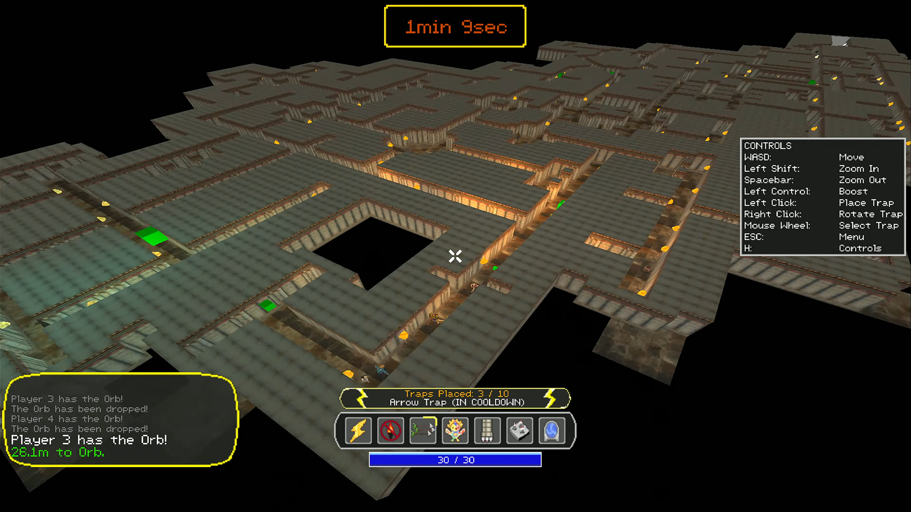

## Wrath of Zeus


[Wrath of Zeus](https://cse125.ucsd.edu/2024/cse125g3/wrath-of-zeus/) is a 3v1 asymmetric maze escape game where 3 players attempt to escape a maze while Zeus tries to stop them from above. It was entirely developed through the course of 10 weeks as a project for UCSD's [CSE 125 course](https://cse125.ucsd.edu/), run by Professor [Geoffrey Voelker](https://cseweb.ucsd.edu/~voelker/).

The players have to find a magical orb and escape within a time limit, while Zeus can use lightning bolts, dim the lights, and place various traps in order to stop them.

The players win when one player escapes with the orb. However, picking up the orb for the first time starts a 5 minute timer. If after 5 minutes the players have not escaped the maze, then Zeus wins. In addition, Zeus can prematurely start the timer before the players pick up the orb if the players die 3 times.

An important thing to keep in mind while playing is that the color of the torchlights is your guide through the maze. If you see the torches start to turn more blue, then you are getting closer to the orb, and if they start to turn more white, then you are getting closer to the exit. This is crucial for both the players and Zeus as they navigate around the maze and try to find their way out / smite those pesky mortals.

Made by
- Tyler Lentz
- Anthony Tarbinian
- Edward Jin
- David Min
- Ted Park
- Anthony Tarbinian
- Jiawen (Coco) Wang

## Screenshots










## Important Notes Before Playing

### General

1. By default the game will load in configuration options from the file titled "Config" or "Config.json"
2. If your client or server fails to open with no explanation, it is likely that you have a malformed config file. For an error message you can try running the program in the command line. If you are unsure how to do that, then I would recommend you revert your config file back to the default.
3. The UI is optimized to work on 1920x1080p monitors. On any other resolution it will attempt to scale UI, but it will likely look very off.
4. The networking code will likely be unplayable on anything other than a LAN, and even on Wi-Fi it will be suboptimal.
5. You can increase the number of players in a lobby, but certain elements of the UI may break and we cannot make any promises about performance! Anecdotally, however, the game
   still plays well with 5 total players.

### Config Options Explanations

```json
{
    "port"------------------> port that the server runs on and the client connects to
    "server": {
        "lobby_name"--------> name of the server lobby
        "lobby_broadcast"---> whether or not the server sends discovery packets on the LAN
        "max_players"-------> how many players must connect to the server before the game can start
        "disable_zeus"------> whether or not a player should be allowed to play as Zeus
        "skip_intro"--------> whether or not the intro cutscene should be skipped
        "disable_enemies"---> whether or not enemies should spawn in the maze
        "maze": {
            "directory"-----> high level directory that all of the maps are in
            "procedural"----> whether or not to use a procedurally generated maze
            "maze_file"-----> filepath (relative to the above directory) of a maze file to load in, if procedural is false
        }
    },
    "client": {
        "lobby_discovery"---> whether or not the client listens for servers that are broadcasting discovery packets
        "fullscreen"--------> whether or not the window should be fullscreen, or a 1920x1080p window
        "fps_counter"-------> whether or not to display the current FPS in the top left of the screen
        "presentation"------> shifts the hotbar UI up slightly, for use during the CSE 125 demo to make sure the UI could be seen by audience members in the auditorium
        "render"------------> beyond this distance, for players no objects will be rendered, and for Zeus certain traps will not be rendered
    }
}
```

### Custom Map Generation

If you would like to try your hand at creating some custom mazes or rooms which will be used in the procedural generation algorithm, you can create appropriate maze files in the "maps" directory. If you just want to load in an entirely custom maze then it doesn't matter where it is placed (as long as you put the appropriate path in your configuration file), but if you want the procedural algorithm to use your rooms then you should place them in the directories called "10x10" and "20x20". There is also a directory called "40x40" and the game will attempt to use these 40x40 rooms in the game, but I cannot promise that they will totally work as they are very much untested as we found it was too much effort to make engaging 40x40 rooms and you did not gain much from it. But maybe you will have better luck with it!

Rules When Designing Rooms:
1. A room must be fully connected, which means that entering from any entryway you should be able to exit from any other entryway in that room.
2. Room door placements must be along the midpoints of the 10x10 sections of each room, as shown in the .empty template maze files.
3. You CAN block entryways into a room, but for 20x20 and 40x40 rooms if you block off one entryway you must also block off all of the other entryways on that side.
4. I think the game will let you make a room with no entrances, but you shouldn't do that for obvious reasons.

## Attributions

TomMusic's [Free Fantasy 200 SFX Pack](https://tommusic.itch.io/free-fantasy-200-sfx-pack).

## Development

All of the following sections are aimed towards development 

### Code Documentation

View deployed documentation [here](https://cse125.ucsd.edu/2024/cse125g3/docs/html/)

#### Build Docs Locally 

1. We are using Doxygen which you can install locally from [here](https://www.doxygen.nl/download.html)
2. Run `doxygen` from the root of the directory
3. Open the `html` files in the `docs` directory of the repo

### Setup

#### Windows (In Visual Studio)

1. Download Visual Studio (if you are on a lab computer, it will already be installed)
2. Clone the repo
    - In Visual Studio you should have gui option to clone from a Github Repo
		- in the popup window put in this URL: `https://github.com/ucsd-cse125-sp24/group3.git`
    - Alternatively, you can use the command line and then open Visual Studio in the directory where you cloned it:
		- `git clone https://github.com/ucsd-cse125-sp24/group3.git`
3. Everything should just work�. To run the program, you can click on the green arrow at the top bar that says "Select Startup Item." There is a dropdown arrow on the right side which will let you select between running the client and the server.

#### Linux / Mac

Note: If you work locally this way, you should make sure that before you merge anything into main that it also compiles on a lab computer running Visual Studio. There might be some small differences between how the microsoft compiler handles things, and how `g++` handles things, and we always want to make sure it compiles on a lab computer.

1. Download these dependencies:
	1. `cmake`
		- Minimum version 3.13
		- [Install Instructions](https://cgold.readthedocs.io/en/latest/first-step/installation.html)
	2. `g++`
		- Should be new enough support C++20 features
		- Mac: [here](https://formulae.brew.sh/formula/gcc)
		- Linux: use your favorite package manager, if it isn't already installed.
	3. `make`
		- Mac: [here](https://formulae.brew.sh/formula/make).
		- Linux: it probably is already installed on your system, but if not use your favorite package manager.
	4. OpenGL
		- TODO: figure out what version the lab computers have installed, and then put instructions to install it here.
    5. Various Libraries
        - Some libraries are needed that might not be installed on your system already. Here is a short list of various libraries that you might need. If you do not have apt, then you can find the corresponding packages in whatever package manager you are using
        ```
        sudo apt install libopenal-dev libvorbis-dev libflac-dev
        ```
2. Verify installations:
    - Enter in `cmake`, `g++`, and `make` into your terminal
    - Confirm that each of these commands are recognized by your system
    - If not, you may have to modify your system path. But generally your system package manager (e.g. `homebrew`, `apt`) should do this for you, so you should verify that your package manager actually installed the program.
3. Clone the repo
    - Go to your favorite location in your file system
    - `git clone https://github.com/ucsd-cse125-sp24/group3.git`.
    - `cd group3`
4. Once you are in the directory you cloned, enter the following commands:
    - `mkdir build`
    - `cd build`
    - `cmake ..`
    - Let CMake run...
5. CMake should have generated a bunch of stuff inside of the build directory. One of these things should be a Makefile. Verify that there is a Makefile in the `build` directory.
6. To compile the program, enter these commands (depending on what you want to do)
    - `make` (to compile everything)
    - `make client` (to compile the client executable)
    - `make server` (to compile the server executable)
7. To run one of the executables, enter the following (from the build directory)
    - `bin/client` (to run the client)
    - `bin/server` (to run the server)
	- Note that the full filepaths for the executables are `build/bin/server` and `build/bin/client`, so if you are outside of the build directory you will need to give the full path.


### Code Structure

The repo is structured into 3 main sections:

- `client`: code for the client
- `server`: code for the server
- `shared`: shared library code that both the client and server depend upon

In addition, there is a distinction between the `include` and `src` directories. Internally, these directories have very similar structure, but the `include` directory includes all of the header (.hpp) files and the src directory includes all of the source files (.cpp).

### CMake Structure

There are 4 `CMakeLists.txt` files throughout the repo.

- `CMakeLists.txt`: high level set up of CMake itself
- `src/shared/CMakeLists.txt`: handles the creation of the shared library which is later linked into the client and server executables
- `src/client/CMakeLists.txt`: handles the creation of the client executable, which includes linking in our own shared library code and any other 3rd party libraries needed for the client.
- `src/server/CMakeLists.txt`: same as above, but for the server.

### `#include`ing Header Files

To include a header file, make sure you use the full file path starting from the `include` directory. So, for example, to include the `GameState` class in some source file, you would put at the top

```cpp
#include "shared/game/gamestate.hpp"
```

### Adding New Files

To add a new file it is fairly simple, but you just have to make sure that you update the corresponding `CMakeLists.txt` file so that CMake includes your src file in the compilation. (Header files will automatically be included once they are placed).

For example, if you want to add a file somewhere in the shared library section of the repo, make sure you add the filename to `src/shared/CMakeLists.txt`.

### Adding New Libraries

Depending on where you need to link the library (client, server, shared), you will need to go to that `CMakeLists.txt` file and include the relevant CMake incantations/spells/general wizardry to link that library into the specific target. This will likely vary depending on what you are trying to add.

### Useful VSCode Extensions

- [C++ Intellisense](https://marketplace.visualstudio.com/items?itemName=ms-vscode.cpptools)
- [General Productivity](https://marketplace.visualstudio.com/items?itemName=jirkavrba.subway-surfers)

### Models

You can download models from our Google Drive folder [here](https://drive.google.com/drive/folders/1N7a5cDgMcXbPO0RtgznnEo-1XUfdMScM?usp=sharing) and place them in `src/client/models`. Alternatively, you can install [gdown](https://github.com/wkentaro/gdown) and run `make pull_models` to automatically pull them.

### Testing

We are using [GoogleTest](https://google.github.io/googletest/) for unit testing. They run automatically in GitHub actions or can also be done manually.

There are three categories of unit tests:

1. Client tests for client specific code
2. Server tests for server specific code
2. Shared tests for code shared between the client and server 

### Running Tests Locally

From the build directory run the following commands for each testing category:

```sh
make run_client_tests
make run_server_tests
make run_shared_tests
```

### Adding New Tests 

1. Add a new `.cpp` file to the testing directory you want (either `src/client/tests`, `src/server/tests` or `src/shared/tests`).

2. Add a testing function with the GoogleTest `TEST` macro. See [this](https://google.github.io/googletest/reference/assertions.html) page to see all the available assertions.
```cpp
// Tests factorial of positive numbers.
TEST(FactorialTest, HandlesPositiveInput) {
  EXPECT_EQ(Factorial(1), 1);
  EXPECT_EQ(Factorial(2), 2);
  EXPECT_EQ(Factorial(3), 6);
  EXPECT_EQ(Factorial(8), 40320);
}
```
3. Run the tests locally with the steps above or with GitHub actions

### Linting

We are using [cppcheck](https://github.com/danmar/cppcheck) for linting and static code analysis. They run automatically with GitHub actions.

#### Suppressing errors

You can suppress a single error by adding comments in the following format after the lint in question:

```cpp
int x = 5; // cppcheck-suppress unusedVariable 
```

You can also pass in `--suppress <check-name>` to cppcheck. You can modify the flags that `make lint` uses by modifying the lint target's definition in the root level CMakeLists.txt.

#### Linting locally 

##### Linux/macOS
Install cppcheck on your system based on instructions [here](https://cppcheck.sourceforge.io/)

##### Windows
Visual Studio supports a [cppcheck plugin](https://github.com/VioletGiraffe/cppcheck-vs-addin/tree/1.5)

### Run

From inside the build directory run:

```sh
make lint
```
